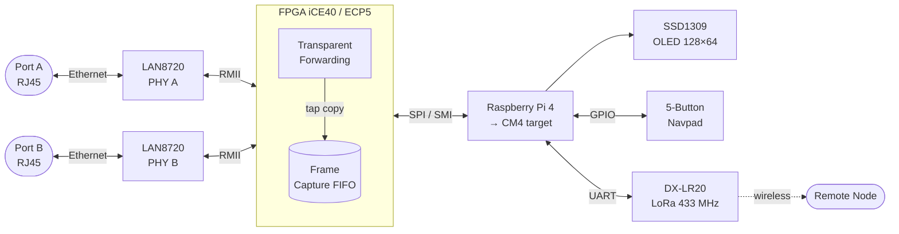

```
  ███████╗ ██████╗    ██████╗  ██████╗  ██████╗ ██╗     
  ██╔════╝██╔═══██╗  ╚════██╗██╔═══██╗██╔═══██╗██║     
  █████╗  ██║   ██║   █████╔╝██║   ██║██║   ██║██║     
  ██╔══╝  ██║▄▄ ██║  ██╔═══╝ ██║   ██║██║   ██║██║     
  ███████╗╚██████╔╝  ███████╗╚██████╔╝╚██████╔╝███████╗
  ╚══════╝ ╚══▀▀═╝   ╚══════╝ ╚═════╝  ╚═════╝ ╚══════╝
                 Passive Ethernet Network Tap
```

---

## Introduction

**EQ200L** is a hardware + firmware project for building a passive, transparent Ethernet network tap. Traffic flowing between two network endpoints passes through the device unmodified. The FPGA sits in-line, captures a copy of every frame in both directions, and feeds it to a Raspberry Pi for processing and analysis.

The system uses LAN8720 PHY breakouts for Ethernet connectivity, exposes a menu-driven OLED interface on the Pi, and includes a LoRa radio link for wireless data relay.

**Hardware progression:**

| Stage | FPGA | Host Pi | Notes |
|-------|------|---------|-------|
| Testing | Olimex iCE40HX8K-EVB | Pi Zero 2W | Pi Zero 2W RAM too limited for on-device builds |
| **Current** | **iCeSugar Pro (ECP5)** | **Raspberry Pi 4** | Build and flash from Pi 4 over USB |
| Target | iCeSugar Pro (ECP5) | CM4 8GB, 0GB eMMC | Final embedded form factor |

---

## File Tree

```
eq200l/
├── README.md                         ← you are here
│
├── ICE/                              ← FPGA designs & toolchain
│   ├── install.sh                    ← toolchain installer
│   ├── requirements.txt              ← Python deps for build scripts
│   ├── lib/                          ← reusable Verilog modules
│   │   ├── async_fifo.v
│   │   ├── bram_fifo.v
│   │   ├── cdc_sync.v
│   │   ├── rmii_rx.v                 ← RMII dibit → byte stream
│   │   ├── rmii_tx.v                 ← byte stream → RMII dibit
│   │   ├── spi_slave.v               ← SPI interface to Pi
│   │   ├── sync_fifo.v
│   │   └── uart_tx.v
│   │
│   ├── olimex-ice40hx8k/             ← iCE40HX8K-EVB board target
│   │   ├── hw/                       ← basic design: RMII rx → UART tx
│   │   │   ├── src/top.v
│   │   │   ├── top.pcf
│   │   │   └── Makefile
│   │   ├── sim/                      ← testbench for hw/
│   │   │   ├── src/  tb/  sim/
│   │   │   └── Makefile
│   │   └── projects/
│   │       ├── blink_button/
│   │       ├── spi_message/          ← SPI comms demo
│   │       └── eq200l/               ← dual-port tap (main project)
│   │           ├── src/
│   │           ├── top.pcf
│   │           └── Makefile
│   │
│   └── icesugar-pro/                 ← ECP5 iCeSugar Pro board target
│       ├── hw/                       ← 25 MHz single-clock tap
│       │   ├── src/top.v
│       │   ├── top.lpf
│       │   └── Makefile
│       ├── sim_tap/                  ← full tap sim with SMI interface
│       │   ├── src/  tb/
│       │   └── Makefile
│       └── docs/
│           ├── README.md             ← SODIMM-200P pinout table
│           └── wiring.md             ← LAN8720 ↔ FPGA connections
│
├── PI/                               ← Raspberry Pi software
│   └── interface/                    ← OLED menu UI
│       ├── main.py                   ← scrollable menu application
│       ├── display.py                ← SSD1309 I2C driver
│       ├── buttons.py                ← GPIO button polling + debounce
│       ├── requirements.txt          ← luma.oled, RPi.GPIO, Pillow
│       └── TEST/                     ← unit tests
│
├── LoRa/                             ← LoRa wireless subsystem
│   ├── lora_terminal.py              ← UART ↔ LoRa bridge terminal
│   ├── probe.py                      ← DX-LR20 chip probe utility
│   └── docs/                         ← datasheets & module info
│
└── docs/                             ← hardware documentation
    ├── eq200l schematics/            ← project schematics
    ├── icesugar-pro/                 ← ECP5 board docs & pinout image
    ├── ice40hx8k/                    ← iCE40 board docs
    ├── LAN8720 ETH Board/            ← PHY datasheet
    ├── LoRa/                         ← LoRa module docs
    └── examen arbete YRGO/           ← exam work archive
```

---

## System Flow



---

## Features

### FPGA Core

| Feature | Status |
|---------|--------|
| Transparent dual-port Ethernet forwarding | Implemented |
| RMII frame capture — iCE40HX8K target | Implemented |
| RMII frame capture — ECP5 iCeSugar Pro target | Implemented |
| Frame capture FIFO (BRAM-backed) | Implemented |
| Packet filtering in FPGA | TBI |

### Host Interface

| Feature | Status |
|---------|--------|
| UART frame output to host | Implemented |
| SPI slave interface to Pi | Implemented |
| SMI high-bandwidth interface to Pi | TBI |
| SMI DMA burst transfers | TBI |

### Toolchain & Build

| Feature | Status |
|---------|--------|
| FPGA flash via Pi SPI + flashrom (iCE40) | Implemented |
| FPGA flash via openFPGALoader (ECP5) | Implemented |
| iverilog simulation + GTKWave waveforms | Implemented |
| ice.sh CLI workflow menu | Implemented |

### User Interface

| Feature | Status |
|---------|--------|
| SSD1309 OLED menu UI (128×64, I2C) | Implemented |
| 5-button navigation with debounce | Implemented |
| Web interface for captured traffic | TBI |

### Wireless

| Feature | Status |
|---------|--------|
| LoRa UART bridge terminal | Implemented |
| LoRa chip probe / configuration utility | Implemented |
| Wireless streaming of captures via LoRa | TBI |

### Software / Analysis

| Feature | Status |
|---------|--------|
| Pi-side frame decoder / pcap export | TBI |

### Hardware Platform

| Milestone | Status |
|-----------|--------|
| iCE40HX8K-EVB + Pi Zero 2W (initial testing) | Implemented |
| iCeSugar Pro (ECP5) + Raspberry Pi 4 (current) | Implemented |
| CM4 8GB RAM, 0GB eMMC — final form factor | TBI |

---

## Devices

### FPGA — iCeSugar Pro (ECP5) — *current board*

Lattice ECP5 FPGA on a compact module with a DDR-SODIMM-200P edge connector and a
built-in iCELink DAPLink USB adapter (`0x0d28:0x0204`). Programmed via
`openFPGALoader --cable cmsisdap` directly from the Pi 4 over USB — no SPI
programmer needed.

## DDR-SODIMM-200P
| Function | Top-Pin | Bot-Pin | Function |
|----------|---------|---------|----------|
|   GND    |    1    |    2    |   5V     |
|   GND    |    3    |    4    |   5V     |
|   GND    |    5    |    6    |   5V     |
|   GND    |    7    |    8    |   5V     |
|   GND    |    9    |    10   |   5V     |
|   GND    |    11   |    12   |   5V     |
|   NC     |    13   |    14   |   NC     |
|   NC     |    15   |    16   |   NC     |
|   NC     |    17   |    18   |   NC     |
|   NC     |    19   |    20   |   NC     |
|   NC     |    21   |    22   |   NC     |
|   NC     |    23   |    24   |   NC     |
|   NC     |    25   |    26   |   NC     |
|   NC     |    27   |    28   |   NC     |
|   NC     |    29   |    30   |   NC     |
|   NC     |    31   |    32   |   NC     |
|   NC     |    33   |    34   |   NC     |
|   NC     |    35   |    36   |   NC     |
|   NC     |    37   |    38   |   NC     |
|   GND    |    39   |    40   |   GND    |
|          |         |         |          |
|          |         |         |          |
|   A8     |    41   |    42   |   P11    |
|   NC     |    43   |    44   |   P12    |
|   NC     |    45   |    46   |   N12    |
|   NC     |    47   |    48   |   P13    |
|   B8     |    49   |    50   |   N13    |
|   A7     |    51   |    52   |   P14    |
|   NC     |    53   |    54   |   M12    |
|   GND    |    55   |    56   |   GND    |
|   B7     |    57   |    58   |   M13    |
|   A6     |    59   |    60   |   L14    |
|   B6     |    61   |    62   |   L13    |
|   A5     |    63   |    64   |   K14    |
|   B5     |    65   |    66   |   K13    |
|   A4     |    67   |    68   |   J14    |
|   B4     |    69   |    70   |   J13    |
|   A3     |    71   |    72   |   H14    |
|   B3     |    73   |    74   |   H13    |
|   A2     |    75   |    76   |   G14    |
|   B1     |    77   |    78   |   G13    |
|   B2     |    79   |    80   |   F14    |
|   C1     |    81   |    82   |   F13    |
|   C2     |    83   |    84   |   E14    |
|   D1     |    85   |    86   |   E13    |
|   D3     |    87   |    88   |   E12    |
|   E1     |    89   |    90   |   C13    |
|   E2     |    91   |    92   |   D13    |
|   F1     |    93   |    94   |   C12    |
|   F2     |    95   |    96   |   D12    |
|   G1     |    97   |    98   |   C11    |
|   G2     |    99   |    100  |   D11    |
|   H2     |    101  |    102  |   C10    |
|   J1     |    103  |    104  |   D10    |
|   GND    |    105  |    106  |   GND    |
|   GND    |    107  |    108  |   GND    |
|   J2     |    109  |    110  |   C9     |
|   K1     |    111  |    112  |   D9     |
|   K2     |    113  |    114  |   C8     |
|   L1     |    115  |    116  |   D8     |
|   L2     |    117  |    118  |   C7     |
|   M1     |    119  |    120  |   D7     |
|   M2     |    121  |    122  |   C6     |
|   N1     |    123  |    124  |   D6     |
|   N3     |    125  |    126  |   C5     |
|   P1     |    127  |    128  |   D5     |
|   P2     |    129  |    130  |   C4     |
|   R1     |    131  |    132  |   D4     |
|   R2     |    133  |    134  |   C3     |
|   T2     |    135  |    136  |   E4     |
|   R3     |    137  |    138  |   E3     |
|   T3     |    139  |    140  |   F4     |
|   R4     |    141  |    142  |   F3     |
|   T4     |    143  |    144  |   G4     |
|   R5     |    145  |    146  |   G3     |
|   R6     |    147  |    148  |   H3     |
|   T6     |    149  |    150  |   J4     |
|   P7     |    151  |    152  |   J3     |
|   R7     |    153  |    154  |   K4     |
|   R8     |    155  |    156  |   K3     |
|   GND    |    157  |    158  |   GND    |
|   NC     |    159  |    160  |   NC     |
|   NC     |    161  |    162  |   NC     |
|   NC     |    163  |    164  |   NC     |
|   NC     |    165  |    166  |   NC     |
|   NC     |    167  |    168  |   NC     |
|   NC     |    169  |    170  |   NC     |
|   NC     |    171  |    172  |   NC     |
|   NC     |    173  |    174  |   NC     |
|   NC     |    175  |    176  |   NC     |
|   NC     |    177  |    178  |   NC     |
|   NC     |    179  |    180  |   NC     |
|   NC     |    181  |    182  |   NC     |
|   NC     |    183  |    184  |   NC     |
|   NC     |    185  |    186  |   NC     |
|   NC     |    187  |    188  |   NC     |
|   NC     |    189  |    190  |   NC     |
|   NC     |    191  |    192  |   NC     |
|   NC     |    193  |    194  |   NC     |
|   NC     |    195  |    196  |   NC     |
|   NC     |    197  |    198  |   NC     |
|   GND    |    199  |    200  |   GND    |

## Ext-Board Pin map
the Ext-Board is origin designed for Colorlight i5 module, in [Colorlight-FPGA-Projects](https://github.com/wuxx/Colorlight-FPGA-Projects), there is a on-board DAPLink to do the flash work, the iCESugar-Pro doesn't need it, so the Ext-Board actually is a "real" breakout board.  


### Notes
Please note that some pins of P5 are shared with Ext-Board DAPLink, include {D12, C11, D13, C12, E12, C13, E14, E13}, if you have enough pins, just don't use these pins. if you want to use these pins, one simple way is force the Ext-Board DAPLink run into bootloader. just create a file named `START_BL.ACT` in root directory of DAPLink. for example, type `$cd /media/pi/DAPLink && touch START_BL.ACT`

> `icesprog` does **not** work with the iCELink firmware — it expects VID `0x1d50`.
> Use `openFPGALoader` instead.

**Toolchain:** `yosys` → `nextpnr-ecp5` → `ecppack` → `openFPGALoader`

**udev rule (run once on the host Pi):**
```bash
sudo tee /etc/udev/rules.d/99-icesugar.rules <<'EOF'
SUBSYSTEM=="usb", ATTRS{idVendor}=="0d28", ATTRS{idProduct}=="0204", MODE="0666", GROUP="plugdev"
SUBSYSTEM=="hidraw", ATTRS{idVendor}=="0d28", ATTRS{idProduct}=="0204", MODE="0666", GROUP="plugdev"
EOF
sudo udevadm control --reload-rules && sudo udevadm trigger
```

See [`ICE/icesugar-pro/docs/wiring.md`](ICE/icesugar-pro/docs/wiring.md) for LAN8720 ↔ ECP5 pin connections.

---

### FPGA — Olimex iCE40HX8K-EVB — *legacy / testing*

Used during initial development. Houses a Lattice iCE40HX8K in a CT256 BGA package.
Programmed via Pi SPI using `flashrom`; the same SPI lines double as the runtime
data path (`spi_slave.v`). Superseded by the iCeSugar Pro for active development.

**Toolchain:** `yosys` → `nextpnr-ice40` → `icepack` → `flashrom`

| Onboard signal | Net | FPGA pin |
|----------------|-----|----------|
| 100 MHz clock | `CLK` | J3 |
| LED 1 | `LED1` | M12 |
| LED 2 | `LED2` | R16 |
| Button 1 | `BUT1` | K11 |
| Button 2 | `BUT2` | P13 |

**RMII connections (LAN8720 ↔ iCE40)**

| Signal | LAN8720 pin | Verilog net | FPGA pin |
|--------|-------------|-------------|----------|
| 50 MHz ref clock | nINT/RETCLK | `pio3_00` | E4 (GBIN) |
| RX data 0 | RXD0 | `pio3_01` | B2 |
| RX data 1 | RXD1 | `pio3_08` | G5 |
| Carrier sense | CRS_DV | `pio3_07` | D2 |
| TX enable | TX_EN | `pio3_02` | F5 |
| TX data 0 | TXD0 | `pio3_09` | D1 |
| TX data 1 | TXD1 | `pio3_03` | B1 |
| Management data | MDIO | `pio3_04` | C1 |
| Management clock | MDC | `pio3_06` | F4 |

**SMI interface (iCE40 ↔ Pi GPIO)**

| Signal | Pi GPIO (BCM) | Verilog net | FPGA pin |
|--------|---------------|-------------|----------|
| SMI Data 0 | 8 | `pio3_15` | F3 |
| SMI Data 1 | 9 | `pio3_16` | H3 |
| SMI Data 2 | 10 | `pio3_17` | F2 |
| SMI Data 3 | 11 | `pio3_18` | H6 |
| SMI Data 4 | 12 | `pio3_19` | F1 |
| SMI Data 5 | 13 | `pio3_20` | H4 |
| SMI Data 6 | 14 | `pio3_21` | G2 |
| SMI Data 7 | 15 | `pio3_22` | J4 |
| SMI Address 0 | 0 | `pio3_23` | G1 |
| SMI Address 1 | 1 | `pio3_24` | J3 |
| SMI Read (SOE) | 18 | `pio3_25` | G3 |
| SMI Write (SWE) | 19 | `pio3_26` | K3 |

---

### Ethernet PHY — LAN8720

Low-power 10/100 Ethernet transceiver in a small breakout module. Provides the
RMII interface (2-bit data, 50 MHz reference clock) between the RJ45 jack and
the FPGA. Two modules are used — one for each network port.

Key signals: `RXD[1:0]`, `CRS_DV`, `TXD[1:0]`, `TX_EN`, `REF_CLK`, `MDIO`, `MDC`.

---

### Host — Raspberry Pi 4 *(current)* → CM4 8GB, 0GB eMMC *(target)*

Runs the user-space software: reads captured frames from the FPGA over SPI (or
SMI), drives the OLED display, handles button input, and bridges data to LoRa.
Also acts as the FPGA programmer — `openFPGALoader` programs the iCeSugar Pro
directly over USB from the Pi 4.

The Pi Zero 2W was used during initial testing but its limited RAM made
on-device synthesis impractical. The Pi 4 is the current development host.
The final target is a **Compute Module 4 (8GB RAM, 0GB eMMC / Lite)** for a
compact embedded form factor.

**Pi 40-pin header — signals used by this project**

| Pin | BCM | Function |
|-----|-----|----------|
| 8 | 14 | UART TXD / SMI Data 6 → FPGA G2 |
| 10 | 15 | UART RXD / SMI Data 7 → FPGA J4 |
| 12 | 18 | SMI Read SOE → FPGA G3 |
| 19 | 10 | SPI0 MOSI / SMI Data 2 → FPGA P11 |
| 21 | 9 | SPI0 MISO / SMI Data 1 → FPGA P12 |
| 23 | 11 | SPI0 CLK / SMI Data 3 → FPGA R11 |
| 24 | 8 | SPI0 CE0 / SMI Data 0 → FPGA R12 |
| 27 | 0 | ID_SDA / SMI SA0 → FPGA G1 |
| 28 | 1 | ID_SCL / SMI SA1 → FPGA J3 |
| 32 | 12 | SMI Data 4 → FPGA F1 |
| 33 | 13 | SMI Data 5 → FPGA H4 |
| 35 | 19 | SPI1 MISO / SMI Write SWE → FPGA K3 |

> SPI0 pins serve double duty: `flashrom` uses them to program the FPGA flash at
> boot time; `spi_slave.v` reuses the same lines at runtime to stream frame bytes.

---

### Display — SSD1309 OLED (128 × 64)

Monochrome OLED display connected to the Pi over I2C. Driven by `luma.oled` +
Pillow. The UI (`PI/interface/main.py`) renders a scrollable 5-item menu with a
dynamic scrollbar and handles up/down/left/right/select navigation.

---

### Wireless — DX-LR20-433M22SP (LoRa)

433 MHz LoRa module connected to the Pi via UART. `LoRa/lora_terminal.py`
provides a threaded UART ↔ LoRa bridge terminal. `LoRa/probe.py` can query and
configure the module's registers.

---

## Workflow

Use the interactive CLI menu to build, flash, and monitor:

```bash
cd ICE
./ice.sh
```

| Option | Action |
|--------|--------|
| `1` Build | rsync sources → Pi, run `make` (yosys → nextpnr → icepack) |
| `2` Upload | pad bitstream to 2 MB → `flashrom` via SPI |
| `3` Build + Upload | both in sequence |
| `4` Simulate | run iverilog locally; sim_tap has sub-menu |
| `5` Open waves | launch GTKWave with saved VCD |
| `6` Monitor UART | stream FPGA UART output as hex dump from Pi |
| `7` Switch project | `hw` / `sim` / `sim_tap` |
| `8` Settings | Pi host, SPI device, UART device, baud rate |

**Manual UART monitor on Pi:**
```bash
stty -F /dev/ttyS0 1000000 raw -echo cs8 -cstopb -parenb
cat /dev/ttyS0 | xxd
```

**Flash ECP5 manually:**
```bash
openFPGALoader --cable cmsisdap --detect
openFPGALoader --cable cmsisdap bitstream.bit
```

---

## Useful Links

| Resource | URL |
|----------|-----|
| Olimex iCE40HX8K-EVB wiki | https://wiki.olimex.com/wiki/ICE40HX8K-EVB |
| iCESugar Pro GitHub | https://github.com/wuxx/icesugar-pro |
| Colorlight FPGA Projects (Ext-Board origin) | https://github.com/wuxx/Colorlight-FPGA-Projects |
| Yosys synthesis suite | https://github.com/YosysHQ/yosys |
| nextpnr place-and-route | https://github.com/YosysHQ/nextpnr |
| Project Trellis (ECP5 bitstream) | https://github.com/YosysHQ/prjtrellis |
| openFPGALoader | https://github.com/trabucayre/openFPGALoader |
| luma.oled Python driver | https://luma-oled.readthedocs.io |
| LAN8720 datasheet | https://ww1.microchip.com/downloads/en/DeviceDoc/00002165B.pdf |
| iCE40 LP/HX family datasheet | `ICE/docs/iCE40LPHXFamilyDataSheet.pdf` (local) |
